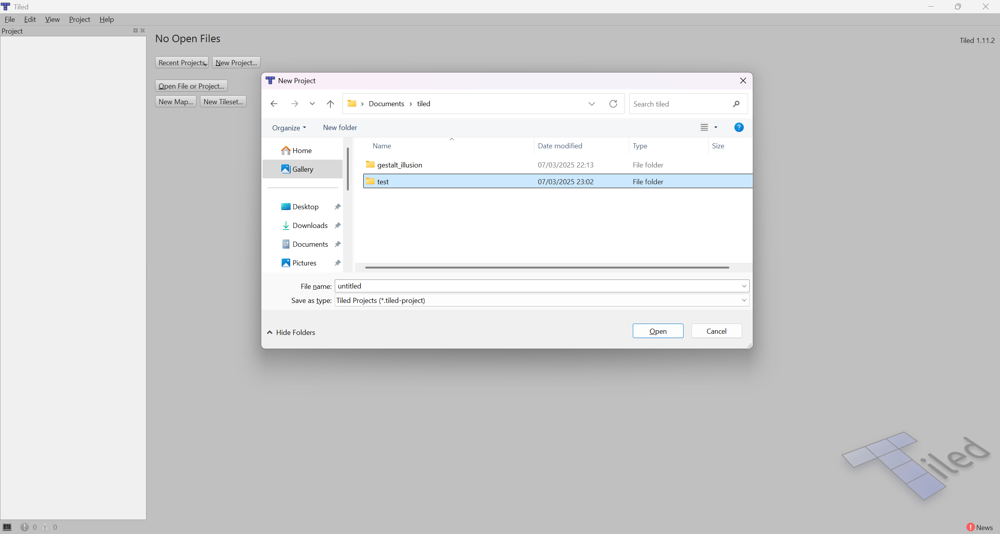
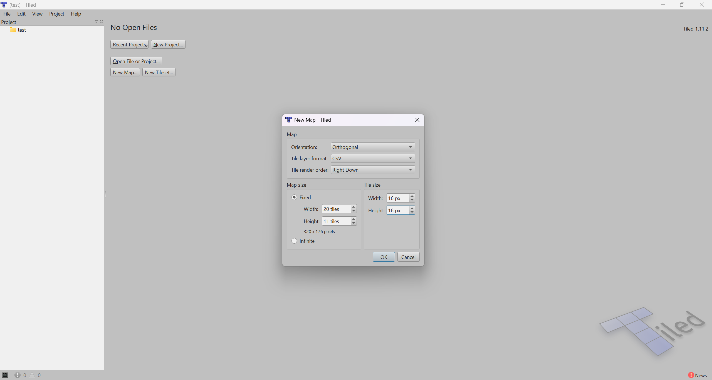
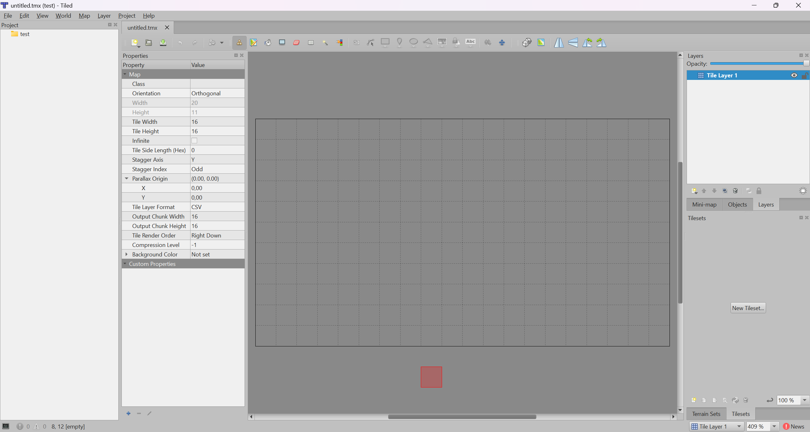
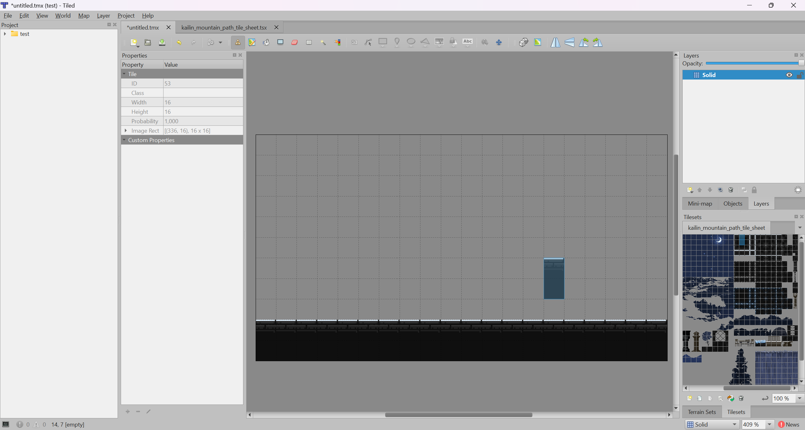
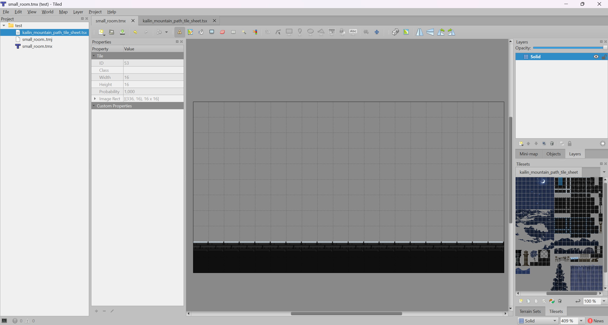

# gestalt-game-engine

My in-house game engine

## Todo
- [x] Ensure that all class have private and public prop, use setter and getter
- [x] Ensure that all are type safe
- [x] Use tiled as editor and draw the pre rendered background
- [-] Write instruction how to use Tiled to make json for this thing
- [ ] Goal is to make a player scene
- [ ] Player should be able to shoot at enemies
- [ ] Enemies should be able to hurt player
- [ ] Should be able to switch stages, need the asset be binded with stages
- [ ] See what else is missing in the core nodes, refer to gestalt illusion hidden repo

## The following are steps to set this up in your local machine and start working on it

Read the following to run this project in your local machine

### This thing uses python 3.13, make sure to install that before hand

The steps to do that is online, just go look it up yourself

### This project was worked on using VS Code

Get the following extensions all from Microsoft

- Pylance
- Python
- Python Debugger

Update the user setting to this to let pylance strict type checks hints only, no error

Hints only and no error since pylance is a static typing checker, not runtime

Static type checker, meaning it only runs before compilation

When compiled we need something else

Once you bundle your code into an .exe, mypy is no longer relevant

Only beartype (runtime checks) will still work inside the compiled binary

We get that later near the bottom

```json
{
  "python.analysis.typeCheckingMode": "strict"
}
```

### Uv setup

Everything written here is from [uv official doc](https://docs.astral.sh/uv)

So things may or may not have changed at the time of reading this

This is for windows, first you want to install uv in your machine in powershell

```powershell
powershell -ExecutionPolicy ByPass -c "irm https://astral.sh/uv/install.ps1 | iex"
```

Then you want to use it to npm init

```powershell
uv init
```

The above will create the following

```
.
├── .python-version
├── README.md
├── main.py
└── pyproject.toml
```

The python version holds the python version you use, uv needs this to make venv

You can use uv to run the main.py

```bash
uv run main.py
```

After running it for the first time, uv will create venv and lock and toml

- lock acts like package.lock.json
    - cross platform dep list, commit this to ensure consistent install in any os
- toml acts like package.json
    - project metadata and also deps

Use uv to install dep, like npm i, dep are all dumped into venv

Whenever you do `uv run`, that uses the venv

This is how you manage dep with uv

Just like npm i

```powershell
uv add requests
```

Just like npm un

```powershell
uv remove requests
```

Upgrade dep

```powershell
uv lock --upgrade-package requests
```

### Ruff for linter and formater

Everything written here is from [ruff official doc](https://docs.astral.sh/ruff/)

So things may or may not have changed at the time of reading this

I am not going to add ruff as dep, because I am using vs code and it has ruff extension

Get vs code ruff extension version 2024.32.0 or later

At the time i am using 2025.14.0

The rest of what is written here is from the ruff vs code extension doc

As in just click the ruff extension from vs code extension listing

Taken together, you can configure Ruff to format, fix, and organize imports on-save

```json
{
  "[python]": {
    "editor.formatOnSave": true,
    "editor.codeActionsOnSave": {
      "source.fixAll": "explicit",
      "source.organizeImports": "explicit",
    },
    "editor.defaultFormatter": "charliermarsh.ruff",
  },
  "python.analysis.typeCheckingMode": "strict"
}
```

Ruff comes with language server that is automatically on

### Ruff pre commit

Everything written here is from [ruff official doc](https://docs.astral.sh/ruff/)

This is a pre-commit hook for ruff

get the pre commit dep, this is not in doc but we need it

```powershell
uv add pre-commit
```

Add this to add the following to your `.pre-commit-config.yaml`:

```yaml
repos:
- repo: https://github.com/astral-sh/ruff-pre-commit
  # Ruff version.
  rev: v0.9.9
  hooks:
    # Run the linter.
    - id: ruff
      args: [ --fix ]
    # Run the formatter.
    - id: ruff-format
```

Tell pre commit to install that yaml so it knows what to do on commit

```powershell
uv run pre-commit install
```

Now on every commit that ruff and lint will run, if it fails commit fails

### Mimic typescript experience, static typing wise not run time throws!

Get vs code mypy extension, because it does more than pylance

Then add the following to the settings

```json
{
  "[python]": {
    "editor.formatOnSave": true,
    "editor.codeActionsOnSave": {
      "source.fixAll": "explicit",
      "source.organizeImports": "explicit",
    },
    "editor.defaultFormatter": "charliermarsh.ruff",
  },
  "python.analysis.typeCheckingMode": "strict",
  "editor.rulers": [88],
  "mypy-type-checker.args": [
    "--strict",
    "--follow-imports=silent",
    "--show-column-numbers",
    "--disallow-untyped-defs",
    "--disallow-untyped-calls",
    "--no-implicit-optional",
    "--warn-redundant-casts",
    "--warn-unused-ignores",
    "--warn-return-any",
    "--disallow-any-unimported",
    "--disallow-any-explicit",
    "--disallow-any-decorated",
    "--disallow-subclassing-any",
    "--strict-equality"
  ]
}
```

Break down each mypy argument and explain why it helps simulate **TypeScript's strict mode** in Python.

### 🔥 **Mypy Arguments Explained**
Each of these flags increases type safety and prevents Python from falling back to dynamic typing.  

| Argument | Description | Why It Simulates TypeScript |
|----------|------------|----------------------------|
| `--strict` | Enables all strict checks | Equivalent to `strict` mode in TypeScript (`tsconfig.json`) |
| `--follow-imports=silent` | Ignores type errors in external libraries without warnings | Prevents unnecessary noise from dependencies |
| `--show-column-numbers` | Shows exact column in errors | Better debugging, just like TS |
| `--disallow-untyped-defs` | **Requires type hints for all function parameters & return values** | Equivalent to `noImplicitAny` in TS |
| `--disallow-untyped-calls` | **Prevents calling functions that lack type hints** | Ensures all functions have proper types like in TS |
| `--no-implicit-optional` | **Requires explicit `Optional[T]` instead of defaulting `None`** | Similar to `strictNullChecks` in TS |
| `--warn-redundant-casts` | Warns if an unnecessary type cast is used | Equivalent to `noUncheckedIndexedAccess` in TS |
| `--warn-unused-ignores` | Warns if `# type: ignore` is unnecessary | Like TS's `noUnusedLocals` |
| `--warn-return-any` | **Errors when a function returns `Any` instead of a proper type** | Prevents implicit `any` return types like in TS |
| `--disallow-any-unimported` | Prevents implicit `Any` types from missing imports | Avoids unchecked types from third-party modules |
| `--disallow-any-explicit` | Prevents manually writing `Any` types | Like `noImplicitAny` in TS |
| `--disallow-any-decorated` | Disallows `Any` in decorators | Prevents untyped decorators, which can break type safety |
| `--disallow-subclassing-any` | **Prevents inheriting from `Any`** | Ensures class-based type safety like TS |
| `--strict-equality` | **Requires `==` and `!=` to be used only on comparable types** | Like TS's `strict` mode, catches comparison issues |

---

### 🔹 **How This Mimics TypeScript's Strict Mode**
| Feature | TypeScript (`strict`) | Python (`mypy --strict`) |
|---------|----------------------|-------------------------|
| No implicit `Any` | ✅ `noImplicitAny` | ✅ `--disallow-untyped-defs`, `--disallow-untyped-calls` |
| No nullable types unless explicitly defined | ✅ `strictNullChecks` | ✅ `--no-implicit-optional` |
| No untyped function arguments | ✅ `noImplicitAny` | ✅ `--disallow-untyped-defs` |
| No untyped function returns | ✅ `strictFunctionTypes` | ✅ `--warn-return-any` |
| Catch unnecessary type casts | ✅ `noUncheckedIndexedAccess` | ✅ `--warn-redundant-casts` |
| Prevent missing imports from causing `Any` | ✅ `skipLibCheck: false` | ✅ `--disallow-any-unimported` |

---

### ✅ **What This Means for Your Code**
With this setup, Python **behaves more like TypeScript**, meaning:
1. **All variables and function parameters must have explicit types.**
2. **`None` and `Optional[T]` are strictly enforced**, just like `strictNullChecks` in TS.
3. **No function can return `Any` unless explicitly allowed** (prevents dynamic typing issues).
4. **You can't call untyped functions**, forcing a fully type-safe codebase.
5. **All classes, decorators, and imports must be typed**, preventing implicit `Any`.

With these settings, your Python code should feel like working with **TypeScript in strict mode**, reducing runtime errors and enforcing static type checking.

### Improve runtime type checks with beartype

```powershell
uv add beartype
```

It makes function calls be safe!

So if you stick with the rule of using setters everywhere, using classes too
Then I think all is safe

1. You create class, what you pass in must be valid
2. You use that class setter, what you pass must also be valid

There is this one weakside to it
So it just checks at function boundaries
Meaning to say if you have invalid assignment in function body it passes sadly
But at least when you return, that value should be valid

So you can create an object

And you also can update its prop

```python
from beartype import beartype
from beartype.roar import BeartypeCallHintParamViolation


class Player:
    @beartype
    def __init__(self, name: str, health: int):
        self._name = name
        self._health = health

    @property
    def name(self) -> str:
        return self._name

    @name.setter
    @beartype
    def name(self, value: str) -> None:
        self._name = value

    @property
    def health(self) -> int:
        return self._health

    @health.setter
    @beartype
    def health(self, value: int) -> None:
        if value < 0:
            raise ValueError("Health cannot be negative")
        self._health = value

    @beartype
    def take_damage(self, damage: int) -> None:
        self.health -= damage


def main() -> None:
    print("🔹 Running Type Safety Tests...\n")

    try:
        player = Player("Knight", 100)
        print("✅ Player created successfully!\n")

        player.health = 50
        print("✅ Health updated successfully!\n")

        player.take_damage(20)
        print("✅ Damage applied successfully!\n")

        print("❌ Trying to set invalid health (-10)...")
        player.health = -10  # Should raise ValueError
    except ValueError as e:
        print(f"✅ Caught ValueError: {e}\n")

    try:
        print("❌ Trying to set invalid name (int instead of str)...")
        player = Player("Knight", 100)
        player.name = 123  # Should raise BeartypeCallHintParamViolation
    except BeartypeCallHintParamViolation as e:
        print(f"✅ Caught BeartypeCallHintParamViolation: {e}\n")

    try:
        print('❌ Trying to pass string "a lot" as damage...')
        player = Player("Knight", 100)
        player.take_damage("a lot")  # Should raise BeartypeCallHintParamViolation
    except BeartypeCallHintParamViolation as e:
        print(f"✅ Caught BeartypeCallHintParamViolation: {e}\n")

    try:
        print("❌ Trying to create player with invalid health (str instead of int)...")
        Player("Warrior", "full")  # Should raise BeartypeCallHintParamViolation
    except BeartypeCallHintParamViolation as e:
        print(f"✅ Caught BeartypeCallHintParamViolation: {e}\n")

    print("🎉 All tests completed!")


if __name__ == "__main__":
    main()
```

For complex stuff you can just make a class for it

Or use dataclass like this for static shapes

```python
from dataclasses import dataclass

from beartype import beartype


@beartype
@dataclass
class User:
    name: str
    age: int


@beartype
def create_user(data: dict) -> User:
    return User(**data)  # ✅ Type safety enforced at runtime


data = {"name": "Alice", "age": 25}
user = create_user(data)  # ✅ Works

data = {"name": "Alice", "age": "twenty-five"}
user = create_user(data)  # ❌ TypeError at runtime!
```

### Testing type safety during runtime

```python
from dataclasses import dataclass

from beartype import beartype
from beartype.roar import BeartypeCallHintParamViolation


class Player:
    @beartype
    def __init__(self, name: str, health: int):
        self._name = name
        self._health = health

    @property
    def name(self) -> str:
        return self._name

    @name.setter
    @beartype
    def name(self, value: str) -> None:
        self._name = value

    @property
    def health(self) -> int:
        return self._health

    @health.setter
    @beartype
    def health(self, value: int) -> None:
        if value < 0:
            raise ValueError("Health cannot be negative")
        self._health = value

    @beartype
    def take_damage(self, damage: int) -> None:
        self.health -= damage


def main() -> None:
    print("🔹 Running Type Safety Tests...\n")

    try:
        player = Player("Knight", 100)
        print("✅ Player created successfully!\n")

        player.health = 50
        print("✅ Health updated successfully!\n")

        player.take_damage(20)
        print("✅ Damage applied successfully!\n")

        print("❌ Trying to set invalid health (-10)...")
        player.health = -10  # Should raise ValueError
    except ValueError as e:
        print(f"✅ Caught ValueError: {e}\n")

    try:
        print("❌ Trying to set invalid name (int instead of str)...")
        player = Player("Knight", 100)
        player.name = 123  # Should raise BeartypeCallHintParamViolation
    except BeartypeCallHintParamViolation as e:
        print(f"✅ Caught BeartypeCallHintParamViolation: {e}\n")

    try:
        print('❌ Trying to pass string "a lot" as damage...')
        player = Player("Knight", 100)
        player.take_damage("a lot")  # Should raise BeartypeCallHintParamViolation
    except BeartypeCallHintParamViolation as e:
        print(f"✅ Caught BeartypeCallHintParamViolation: {e}\n")

    try:
        print("❌ Trying to create player with invalid health (str instead of int)...")
        Player("Warrior", "full")  # Should raise BeartypeCallHintParamViolation
    except BeartypeCallHintParamViolation as e:
        print(f"✅ Caught BeartypeCallHintParamViolation: {e}\n")

    print("🎉 All tests completed!")


@beartype
@dataclass
class UserDto:
    name: str
    age: int


@beartype  # type: ignore
def create_user(data: dict) -> UserDto:  # type: ignore
    return UserDto(**data)  # ✅ Type safety enforced at runtime


def test_user_creation() -> None:
    print("\n🔹 Running Dictionary-to-Class Type Safety Tests...\n")

    try:
        data = {"name": "Alice", "age": 25}
        user = UserDto(**data)  # ✅ Works
        print(f"✅ UserDto created successfully! {user}")
    except Exception as e:
        print(f"❌ Unexpected error: {e}")

    try:
        data = {"name": "Alice", "age": "twenty-five"}  # ❌ Invalid type for age
        user = UserDto(**data)
    except BeartypeCallHintParamViolation as e:
        print(f"✅ Caught BeartypeCallHintParamViolation: {e}")

    try:
        data = {"age": 25}  # ❌ Missing 'name' field
        user = UserDto(**data)
    except TypeError as e:
        print(f"✅ Caught TypeError: {e}")

    try:
        data = {
            "name": "Alice",
            "age": 25,
            "email": "alice@example.com",
        }  # ❌ Extra field
        user = UserDto(**data)
    except TypeError as e:
        print(f"✅ Caught TypeError: {e}")

    print("\n🎉 All tests completed!")


test_user_creation()

if __name__ == "__main__":
    main()
    test_user_creation()
```

You should get this, showing that typesafety does work

```powershell
uv run .\main.py

🔹 Running Dictionary-to-Class Type Safety Tests...

✅ UserDto created successfully! UserDto(name='Alice', age=25)
✅ Caught BeartypeCallHintParamViolation: Method __main__.UserDto.__init__() parameter age='twenty-five' violates type hint <class 'int'>, as str 'twenty-five' not instance of int.
✅ Caught TypeError: UserDto.__init__() missing 1 required positional argument: 'name'
✅ Caught TypeError: UserDto.__init__() got an unexpected keyword argument 'email'

🎉 All tests completed!
🔹 Running Type Safety Tests...

✅ Player created successfully!

✅ Health updated successfully!

✅ Damage applied successfully!

❌ Trying to set invalid health (-10)...
✅ Caught ValueError: Health cannot be negative

❌ Trying to set invalid name (int instead of str)...
✅ Caught BeartypeCallHintParamViolation: Method __main__.Player.name() parameter value=123 violates type hint <class 'str'>, as int 123 not instance of str.

❌ Trying to pass string "a lot" as damage...
✅ Caught BeartypeCallHintParamViolation: Method __main__.Player.take_damage() parameter damage='a lot' violates type hint <class 'int'>, as str 'a lot' not instance of int.       

❌ Trying to create player with invalid health (str instead of int)...
✅ Caught BeartypeCallHintParamViolation: Method __main__.Player.__init__() parameter health='full' violates type hint <class 'int'>, as str 'full' not instance of int.

🎉 All tests completed!

🔹 Running Dictionary-to-Class Type Safety Tests...

✅ UserDto created successfully! UserDto(name='Alice', age=25)
✅ Caught BeartypeCallHintParamViolation: Method __main__.UserDto.__init__() parameter age='twenty-five' violates type hint <class 'int'>, as str 'twenty-five' not instance of int.
✅ Caught TypeError: UserDto.__init__() missing 1 required positional argument: 'name'
✅ Caught TypeError: UserDto.__init__() got an unexpected keyword argument 'email'

🎉 All tests completed!
```

### Testing type safety in compiled binary

Get the dep

```powershell
uv add pyinstaller
```

Then in windows do the following to tell os to ignore your proj dir
Otherwise it wont let pyinstaller make the binary, it thinks its trojan

1️⃣ **Open Windows Security:**  
   - Press `Win + S`, type **"Windows Security"**, and open it.  

2️⃣ **Go to Virus & Threat Protection:**  
   - Click **"Virus & threat protection"** on the left.  

3️⃣ **Manage Exclusions:**  
   - Scroll down and click **"Manage settings"** under "Virus & threat protection settings."  
   - Scroll further and click **"Add or remove exclusions"** under "Exclusions."  

4️⃣ **Add Your Project Folder:**  
   - Click **"Add an exclusion"** → Choose **"Folder"**.  
   - Select your **project directory** (e.g., `C:\Users\clifford\Documents\repos\gestalt-game-engine`).  

5️⃣ **Test Your Executable:**  
   - Run the `.exe` inside the `dist/` folder and check if Windows Defender still flags it.  

Then build the py into exe, this is for NON GUI btw, later for game its different command

```powershell
uv run pyinstaller --onefile --console main.py; Remove-Item -Recurse -Force build, main.spec
```

```powershell
uv run pyinstaller --onefile --noconsole .\src\main.py; Remove-Item -Recurse -Force build, main.spec
```

Run that compiled binary and output the prints to a text file

```powershell
.\dist\main.exe > output.log 2>&1
```

The output text file should look like this

```text
Running Dictionary-to-Class Type Safety Tests...

OK UserDto created successfully! UserDto(name='Alice', age=25)
OK Caught BeartypeCallHintParamViolation: Method __main__.UserDto.__init__() parameter age='twenty-five' violates type hint <class 'int'>, as str 'twenty-five' not instance of int.
OK Caught TypeError: UserDto.__init__() missing 1 required positional argument: 'name'
OK Caught TypeError: UserDto.__init__() got an unexpected keyword argument 'email'

All tests completed!
Running Type Safety Tests...

OK Player created successfully!

OK Health updated successfully!

OK Damage applied successfully!

BAD Trying to set invalid health (-10)...
OK Caught ValueError: Health cannot be negative

BAD Trying to set invalid name (int instead of str)...
OK Caught BeartypeCallHintParamViolation: Method __main__.Player.name() parameter value=123 violates type hint <class 'str'>, as int 123 not instance of str.

BAD Trying to pass string "a lot" as damage...
OK Caught BeartypeCallHintParamViolation: Method __main__.Player.take_damage() parameter damage='a lot' violates type hint <class 'int'>, as str 'a lot' not instance of int.

BAD Trying to create player with invalid health (str instead of int)...
OK Caught BeartypeCallHintParamViolation: Method __main__.Player.__init__() parameter health='full' violates type hint <class 'int'>, as str 'full' not instance of int.

All tests completed!

Running Dictionary-to-Class Type Safety Tests...

OK UserDto created successfully! UserDto(name='Alice', age=25)
OK Caught BeartypeCallHintParamViolation: Method __main__.UserDto.__init__() parameter age='twenty-five' violates type hint <class 'int'>, as str 'twenty-five' not instance of int.
OK Caught TypeError: UserDto.__init__() missing 1 required positional argument: 'name'
OK Caught TypeError: UserDto.__init__() got an unexpected keyword argument 'email'

All tests completed!
```

Proving that type safety is in runtime and compiled exe

### Testing pygame compile type safety

This is the pygame version

```powershell
uv run pyinstaller --onefile --noconsole .\src\main.py; Remove-Item -Recurse -Force build, main.spec
```

Make sure to move the main.exe file beside the main.py, it has to be in same loc

```powershell
.\dist\main.exe
```

### get pydantic used for dto validation

```powershell
uv add pydantic
```

This is how u use it, it creates class instance from dict

```python
with open(Path(self.settings.json_folder_path, room_name), "r") as file:
    data = TiledMapDto.model_validate(json.load(file))
```

## Using Tiled

This thing is using tiled to generate json to draw pre rendered bg

And also to make the str collision data, for solids and thin

Also to indicate where to spawn enemies as well, player positions too

1. Open it
2. Click new project, you want to select an existing empty dir you make before hand
3. Then save the file as the project name inside it



4. Create a new map, here we make a 1 x 1 room (my game biggest room size is 2 x 2)



5. Create a new Tileset



6. When you create a new tileset you pick an image


7. Make layers and start drawing thats it for tiles that have no data



8. Try to save this one, as tmx and json export (it says tmj, edit it to json manually)



That is it, the json is ready

TODO: If you want to know how to add tiles that have data, I will cover that later
TODO: Also need to explain how to do autotiling in tiled later using terrain set
